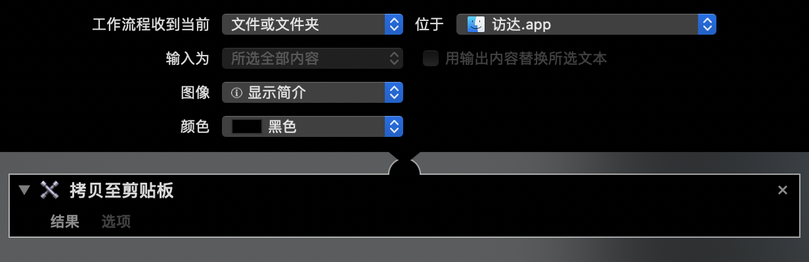

# macOS-workflow
Simple tools on macOS built with Automator.

Only tested on macOS 10.15.

Without robustness, and as long as them work.


## GB18030 to UTF-8

将本地 GB18030 编码的 .txt 文稿转为 UTF-8 编码。


## Video to .mp4

Need FFmpeg installed.

```bash
brew install ffmpeg
```

将本地的视频文件转为通用的 .mp4 格式。使用默认转码规格，输出在源文件夹。


## Remove macOS file in .zip

将 .zip 文件中的系统文件删除。

To convenience the user in different operating system.


## Compress respectively

Rule out macOS files in the meantime.


## Get file path




## Convert between PDF and images

PDF to images: 


Images to PDF: 


## Send documents to Kindle

Need filling-in the bound email address.

